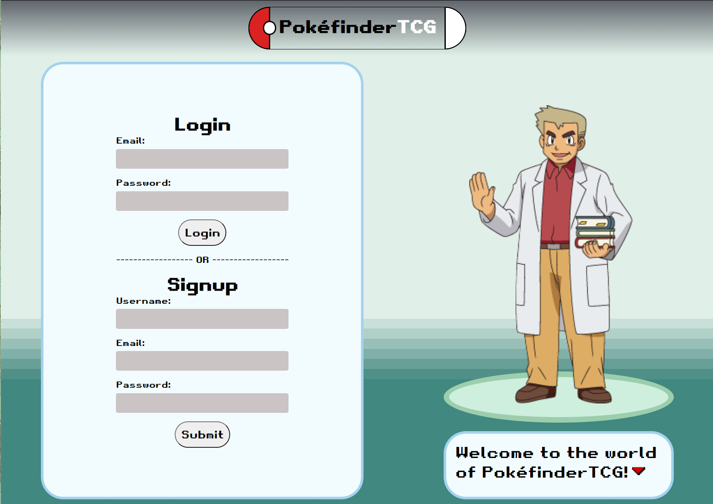
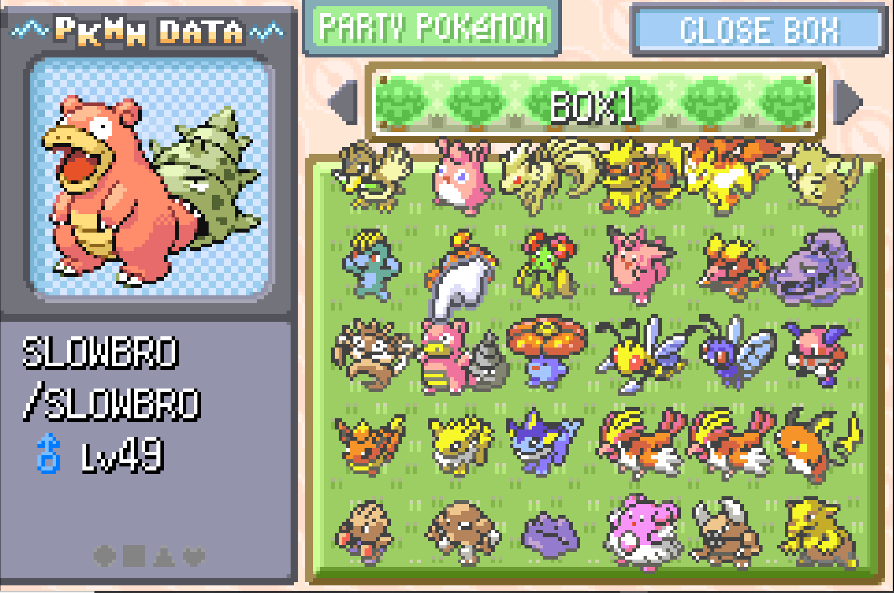
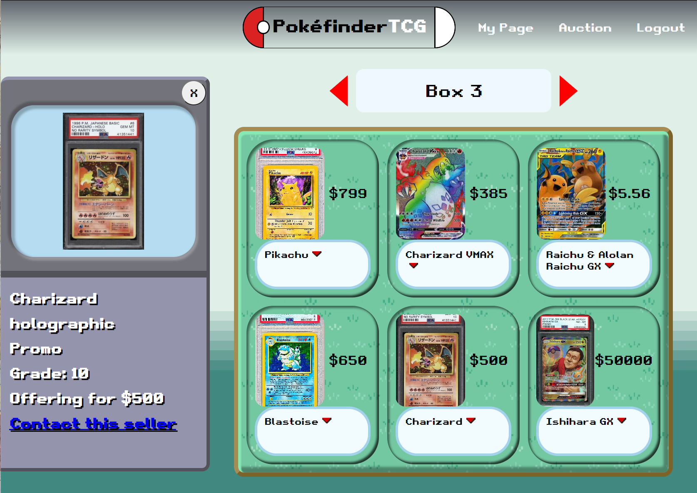

# PokefinderTCG

## Description
Pokefinder TCG is a trading card app that is a meeting ground for those looking to part ways with their cards, and those looking for cards to snatch up. All with a nostalgic coat of paint for Pokemon fans.
After creating an account users can:
- See the cards that other users are trying to sell
- Go to the auction page where they can upload an image of a card, fill in details about it, and post it to sell.
- Contact other users through email by viewing a card's details.

Visit the deployed application and GitHub repository using the links below:

- [Access PokefinderTCG here](https://pokefinder-tcg.herokuapp.com/)

- [See the GitHub Repository for this application here](https://github.com/Spody10/PokefinderTCG)

## Table of Contents
- [Description](#description)
- [Technologies](#technologies)
- [Usage](#usage)
- [Mockups](#mockups)
- [Contributors](#contributors)
- [Assets](#assets)
- [License](#license)

## Technologies
This application is powered by using the MERN stack as well as the following technologies:
- apollo-server-express
- graphql
- jsonwebtoken
- framer-motion
- react-router-dom

## Usage
Create an account by filling out and submitting the corresponding form. You will be redirected to the homepage after singup or login, where you can view the six most recent cards users have posted. If you click the textbox connected to a card you can see more details about the card. At the bottom of the details is a link that will open your email app and create an email draft to that seller for you to contact them. To view more cards you can click on the right arrow next to the box label.

To post your own card, you must go to the auction page, where you will be prompted to upload an image of the card, define a price and name for the card, as well as other optional details, submitting will have your card display on the home page.

## Mockups
This site uses the game Pokemon: FireRed as the inspiration for its design.
[Link to mockup created in figma](https://www.figma.com/file/iwJdlGJFOy189tNAQ6p3GL/pokefinderTCG?node-id=0%3A1)

</img> </img>

</img> </img>

## Contributors
- Christian Bissinger: https://github.com/BeatyPete
- Veronica Williams: https://github.com/veta583518
- Jessica Mangiameli: https://github.com/jessm91
- Michael Spore: https://github.com/Spody10
- Jack Novotny: https://github.com/jenovotny7

## Assets
- [Retro gaming font](https://www.dafont.com/retro-gaming.font)
- [Professor Oak image](https://bulbapedia.bulbagarden.net/wiki/File:Professor_Oak_XY.png)
- [Pokebox grass background](http://minecraft.novaskin.me/skin/5774540746522624/pokemon-grass)
- text-box arrow is a custom made asset

## License 
 
- This application is covered under the MIT license.
